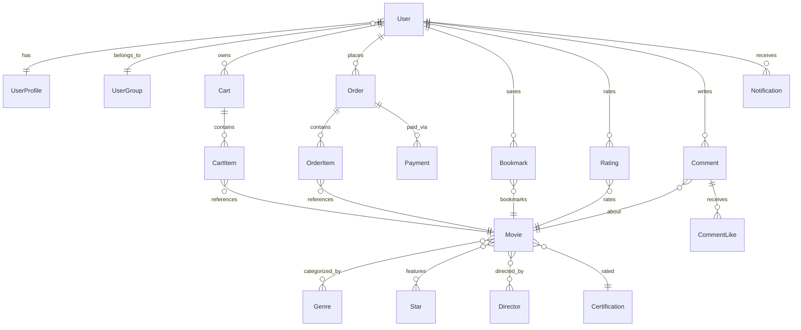

# Online Cinema API

REST API for an online cinema platform with authentication, role-based access, movie catalog, shopping cart, and payment processing.

## Tech Stack

- **Framework:** FastAPI + Gunicorn / Uvicorn
- **Database:** PostgreSQL 17, SQLAlchemy 2.0 (async), Alembic
- **Task Queue:** Celery + Redis (email, cleanup jobs)
- **Payments:** Stripe Checkout + Webhooks
- **Storage:** MinIO (S3-compatible, avatars)
- **Email:** SMTP (Mailpit for local dev)
- **Admin Panel:** SQLAdmin
- **CI:** GitHub Actions (lint, type-check, tests with coverage)

## Quick Start

```bash
# 1. Clone and configure
git clone https://github.com/rpk6432/online-cinema-api
cd online-cinema-api
cp .env.sample .env

# 2. Start all services
docker compose up -d

# 3. Create admin user
docker compose exec app python scripts/create_admin.py
```

The app will be available at `http://localhost:8000`.

## Services

| Service | URL |
|---------|-----|
| API | http://localhost:8000 |
| Swagger UI | http://localhost:8000/docs (admin only) |
| ReDoc | http://localhost:8000/redoc (admin only) |
| Admin Panel | http://localhost:8000/admin |
| Mailpit UI | http://localhost:8025 |
| MinIO Console | http://localhost:9001 |
| Flower (Celery) | http://localhost:5555 |

## API Modules

| Module | Prefix | Description |
|--------|--------|-------------|
| Auth | `/auth` | Register, login, password reset, JWT tokens |
| Users | `/users` | User management (admin) |
| Profiles | `/profiles` | Avatar upload, personal info |
| Movies | `/movies` | CRUD (moderator), search, filtering |
| Genres | `/genres` | Genre catalog |
| Directors | `/directors` | Director catalog |
| Stars | `/stars` | Star catalog |
| Certifications | `/certifications` | Age rating catalog |
| Cart | `/cart` | Shopping cart |
| Orders | `/orders` | Order management |
| Payments | `/payments` | Stripe checkout, webhooks |
| Bookmarks | `/bookmarks` | Movie bookmarks |
| Interactions | — | Ratings, comments, likes |
| Notifications | `/notifications` | In-app notifications |

## Development

```bash
# Install dependencies
poetry install

# Start infrastructure
docker compose up -d

# Lint & format
poetry run ruff check --fix && poetry run ruff format

# Type check
poetry run mypy .
```

## Testing

```bash
# Run all tests with coverage
poetry run pytest --cov --cov-report=term-missing

# Run specific module
poetry run pytest tests/test_auth.py -v

# Run scenario tests only
poetry run pytest tests/test_scenarios.py -v
```

Coverage threshold: **80%** (enforced in CI).

## Project Structure

```
├── src/
│   ├── main.py              # FastAPI app, middleware, error handlers
│   ├── admin.py             # SQLAdmin panel
│   ├── celery_app.py        # Celery configuration
│   ├── core/                # Config, security, dependencies, exceptions
│   ├── crud/                # Database operations
│   ├── database/            # Engine, session, seed
│   ├── models/              # SQLAlchemy models
│   ├── routes/              # API endpoints
│   ├── schemas/             # Pydantic schemas
│   ├── services/            # Stripe integration
│   ├── storages/            # S3 file storage
│   ├── tasks/               # Celery tasks (email, cleanup)
│   └── templates/           # Email templates (HTML + plain text)
├── tests/                   # pytest test suite
├── scripts/
│   ├── create_admin.py      # Create admin user
│   ├── entrypoint.sh        # Docker entrypoint
│   └── initdb/              # Postgres init scripts
├── .github/workflows/       # CI pipeline
├── .env.sample              # Environment template
└── docker-compose.yml       # Service orchestration
```

## Database Schema


